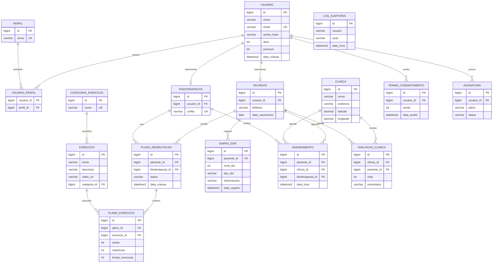

# DER - KINETIX

## Objetivo

Este DER representa a base relacional do KINETIX para suportar autenticacao, perfis, pacientes, fisioterapeutas, clinicas, exercicios, planos de reabilitacao, diario de dor, agendamentos, avaliacoes, consentimento LGPD, auditoria e assinaturas.

## Diagrama Mermaid

## Observacoes

- A tabela `usuario_perfil` permite que um usuario tenha mais de um perfil no futuro.
- `termo_consentimento` registra aceite explicito para LGPD.
- `log_auditoria` foi mantido simples para Sprint 1 e pode evoluir com IP, user agent e entidade afetada.
- `plano_reabilitacao.status` controla estados como ATIVO, BLOQUEADO e FINALIZADO.
